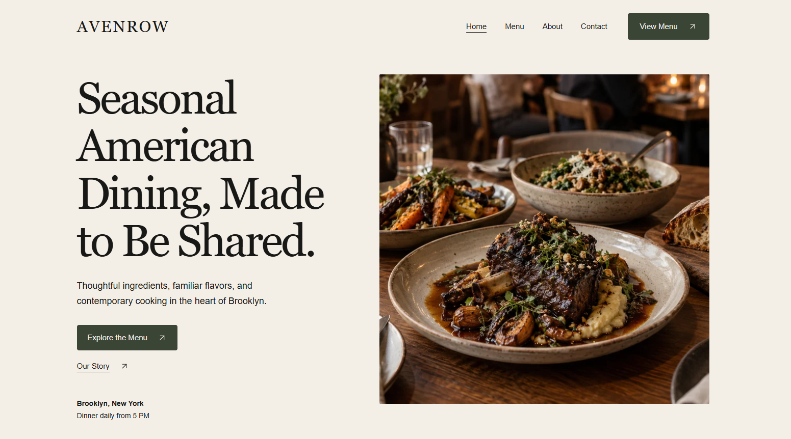
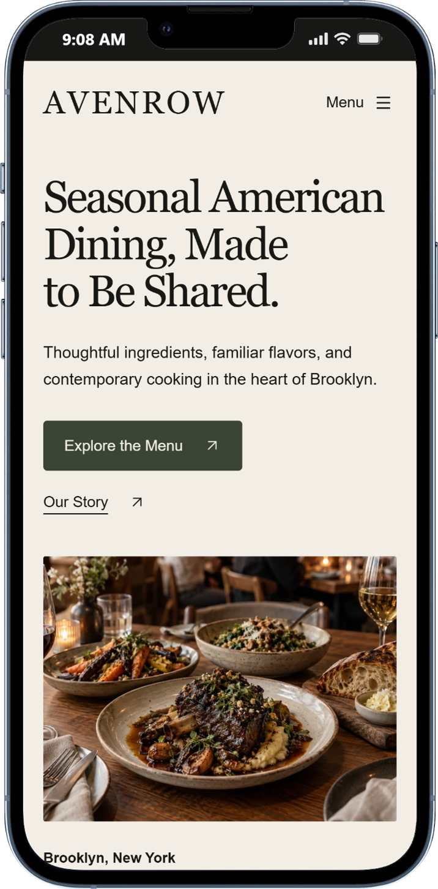
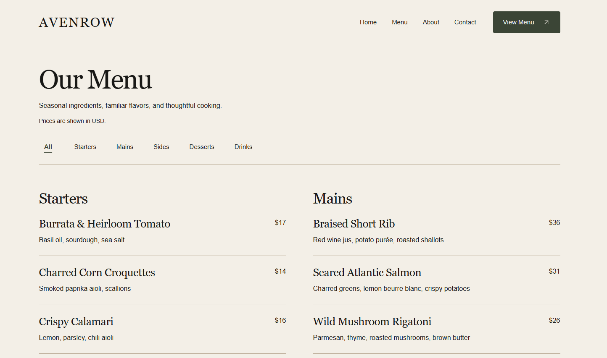
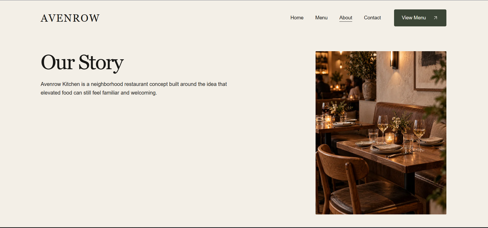
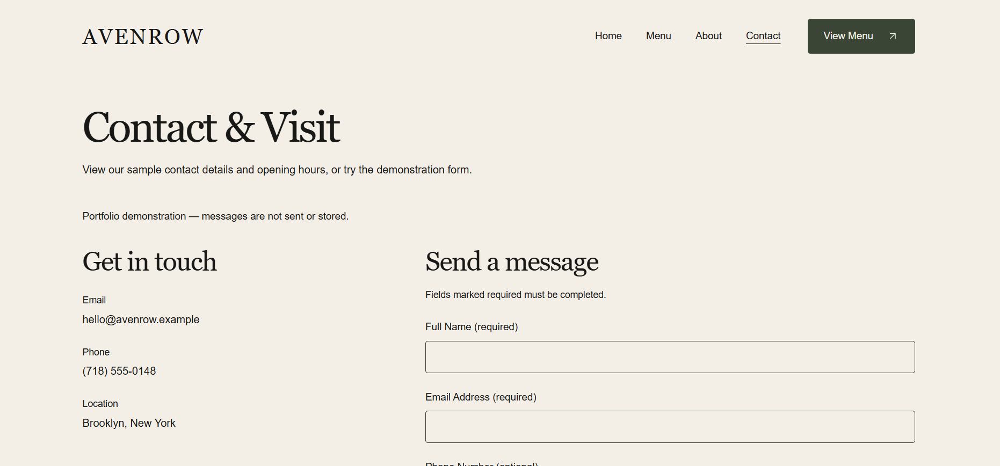

# Avenrow Kitchen

Avenrow Kitchen is a fictional contemporary American restaurant website built as a self-directed frontend portfolio project. It explores editorial restaurant design through responsive React layouts, selective photography, a filterable menu, accessible navigation, and a local-only demonstration contact form.

## Live Demo

https://avenrow-kitchen.vercel.app/

## Preview



## Overview

The project turns a client-style restaurant brief into a four-page frontend experience while keeping the fictional concept transparent. It focuses on editorial composition, readable menu scanning, practical responsive behavior, and honest interactions.

## Key Features

- Responsive React interface with Home, Menu, About, Contact, and recovery routes.
- Editorial Home layout with responsive photography, intentional crops, and reduced-motion support.
- Canonical 18-item menu dataset with accessible category filtering and USD prices.
- In-flow mobile navigation, active route treatment, skip link, route focus, and keyboard support.
- Local-only Contact form with validation, first-invalid focus, duplicate-submit protection, and explicit no-delivery/no-storage messaging.
- Responsive WebP sources, `srcSet`/`sizes`, PNG fallbacks, reserved image dimensions, and prioritized hero loading.
- Route metadata, Open Graph/Twitter metadata, favicon/manifest assets, custom Not Found page, and Vercel SPA routing.

## Pages

| Route | Purpose |
| --- | --- |
| `/` | Editorial introduction, featured dishes, story, gallery, and sample visit information. |
| `/menu` | Filterable sample menu with 18 USD-priced items. |
| `/about` | Concept narrative, principles, and disclosed fictional chef profile. |
| `/contact` | Sample details, canonical hours, and local form demonstration. |

## Selected Screens

<p>
  
  
</p>
<p>
  
  
</p>

All screenshots are real captures from the deployed fictional-concept demo. See the [screenshot record](docs/portfolio-screenshots.md) for the full set, including the Menu mobile capture.

## Tech Stack

React, JavaScript, JSX, Vite, Tailwind CSS, React Router, Framer Motion, Lucide React, and Vercel.

The project contains no TypeScript, backend, database, CMS, authentication, ordering, reservation, payment, analytics, or real contact delivery service.

## Architecture and Implementation Highlights

Reusable layout, UI, image, navigation, menu, and form components keep page composition separate from shared data. `restaurantInfo.js`, `menuData.js`, and `homeImages.js` centralize recurring content and delivery details. Route metadata is managed centrally, while Vercel rewrites direct SPA routes to the app entry.

## Responsive Design and Accessibility

The interface uses content-driven mobile, tablet, and desktop transitions rather than forcing one layout across widths. It supports visible focus, semantic navigation, image alternatives or intentional decorative treatment, reduced motion, mobile disclosure navigation, menu filter states, and associated form errors/status messages.

## Performance and Image Delivery

Approved PNG masters are retained alongside responsive WebP derivatives and PNG fallbacks. The Home hero has 640px, 960px, and 1536px WebP sources; below-the-fold imagery lazy-loads where appropriate. See the [asset inventory](docs/assets.md) and [production report](docs/production-report.md) for measured details and limitations.

## Demo Contact Form

The form validates Full Name, Email, Subject, and Message locally; Phone is optional. A brief local simulation clears valid entries and displays: “Demo complete. Your message was not sent or stored.” No request, database write, email, analytics event containing form values, or storage is used.

## Running Locally

Use Node.js 22.13+ and npm.

```sh
npm ci
npm run dev
```

On Windows PowerShell, use `npm.cmd` if execution policy blocks `npm.ps1`.

## Production Build

```sh
npm run lint
npm run build
npm run preview
```

`vercel.json` provides the SPA rewrite for direct routes.

## Project Status

**Completed / Portfolio Release.** The public demo is deployed on Vercel. Build, lint, local production checks, and hosted HTTP/deep-link checks are documented in [QA](docs/qa.md). Hosted browser interaction, device, screen-reader, Firefox/Safari, social-unfurl, and Lighthouse checks remain useful manual follow-up; no WCAG certification, field-performance result, or commercial outcome is claimed.

## Fictional Concept Disclosure

Avenrow Kitchen is a fictional restaurant concept created as a frontend portfolio project. It is not client work, an operating restaurant, a commercial launch, or a real booking/contact service. Photography and icon provenance remain documented as unresolved in [assets](docs/assets.md); confirm usage rights before any broader commercial use.

For portfolio adaptation, see the [case study](docs/portfolio-case-study.md), [screenshot plan](docs/portfolio-screenshots.md), [Upwork copy](docs/upwork-portfolio.md), and [production report](docs/production-report.md).
